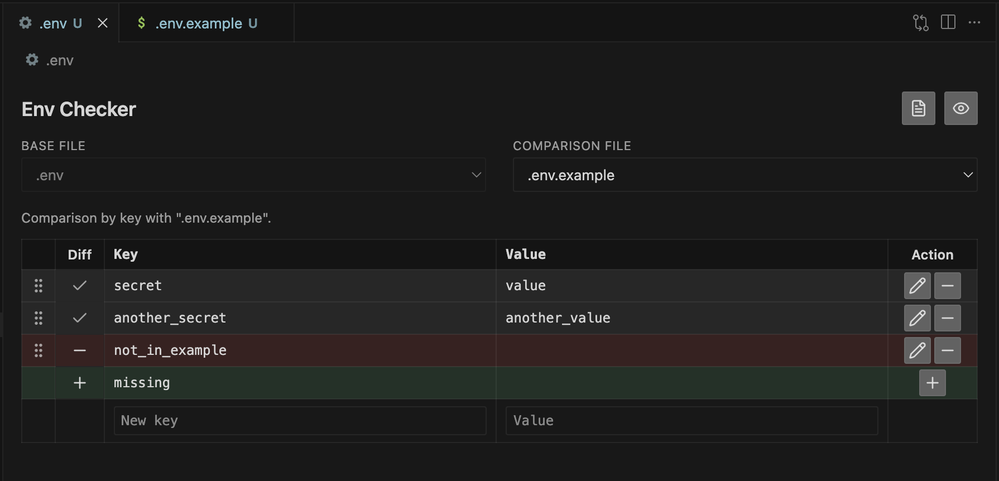

# Env Checker

**Env Checker** is a [Visual Studio Code](https://code.visualstudio.com/) extension that helps you **read**, **document**, and **compare** [dotenv](https://github.com/motdotla/dotenv)-style files (`.env`, `.env.local`, `.env.example`, and similar).

Open an env file in a structured view, see comments as documentation next to each variable, and quickly spot **missing or extra keys** when you compare variants (for example local vs example template).



## Features

- **Custom editor** — Opening `.env` / `.env.*` files on disk uses the Env Checker view (you can switch back to the text editor via the command *Env Checker: Reopen as text editor*).
- **Formatted table** — Keys, values, and merged documentation from `#` lines (above the key and optional inline `#` after the value).
- **Side-by-side comparison** — Pick a base file and a compare file from the same folder; defaults favor `.env` vs `.env.example` when both exist.
- **Live updates** — Changes to env files in that folder refresh the view; unsaved buffer content is used when a file is open in the editor.
- **Dotenv language** — Basic language id `dotenv` for common env filename patterns to improve editing when you use the text editor.

## Requirements

- **VS Code** `1.85.0` or newer.

## Getting started

1. Install the extension from the Marketplace (or load the folder / VSIX for development).
2. Open a file like `.env` or `.env.example` from the Explorer (workspace files on disk).
3. Use the table and file pickers in the webview to compare with another env file in the **same directory**.

## Commands

| Command | Description |
|--------|-------------|
| **Env Checker: Open formatted view** | Opens the comparison webview for the active `.env` file (custom editor or text tab). |
| **Env Checker: Compare with .env.example (and related)** | Same panel, focused on comparing with your example / related files. |
| **Env Checker: Compare env files…** | Choose files from a dialog; opens the panel using the first selection’s folder context. |
| **Env Checker: Reopen as text editor** | When a tab is the Env Checker custom editor, opens the same URI in the default text editor. |

Commands are also available from the **Explorer** context menu and the **editor title bar** when the resource is an env file.

## Settings

| ID | Description |
|----|-------------|
| `envChecker.relatedFileNames` | Basenames in the **same folder** as the active file that are treated as related env files for listing and comparison (in addition to patterns like `.env` / `.env.*`). |

## Parser notes

- Supports optional `export` before `KEY=value`.
- Comment lines immediately above a key attach as documentation; **two or more consecutive blank lines** break that attachment (one blank line is still allowed before the key).
- Quoted values support escaping per common dotenv usage.

## Contributing

Issues and pull requests are welcome in the [GitHub repository](https://github.com/Code-and-Sorcery/vscode-env-checker).

### Development

```bash
pnpm install
pnpm run compile    # esbuild bundle → out/extension.js
pnpm run typecheck  # tsc --noEmit
```

Press **F5** in VS Code to launch the **Extension Development Host** (default build task runs `pnpm run watch`, which rebuilds the bundle on save).

## License

[MIT](LICENSE)

---

## En français

**Env Checker** est une extension VS Code pour **inspecter** et **comparer** vos fichiers `.env` : vue tabulaire, **documentation** issue des commentaires `#`, et mise en évidence des **variables manquantes** ou présentes seulement dans une variante (par ex. `.env` vs `.env.example`). Les chaînes d’interface sont partiellement disponibles en français via la langue d’affichage de VS Code.
